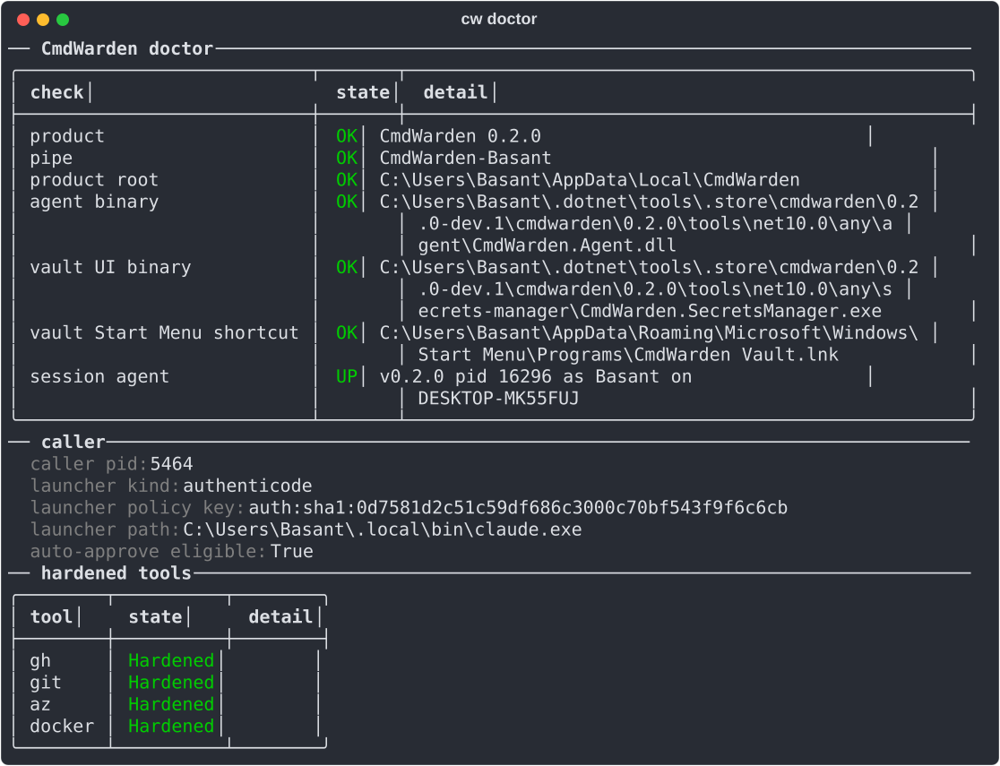
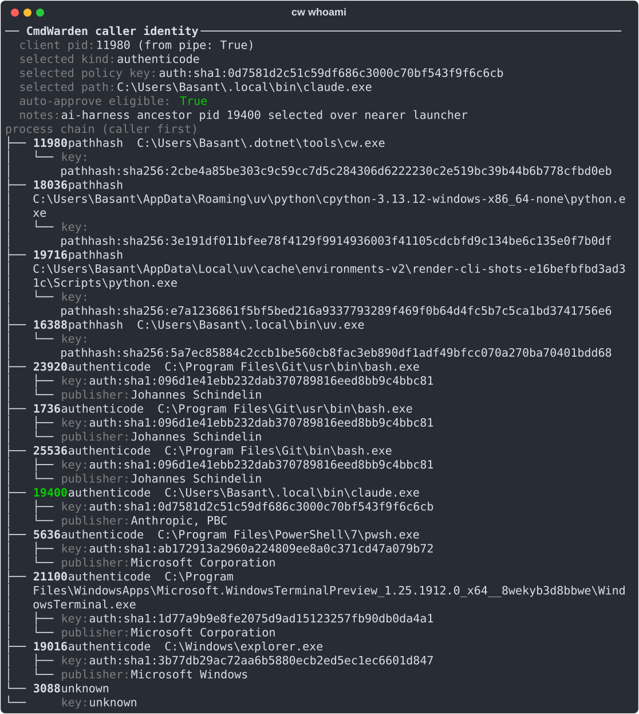
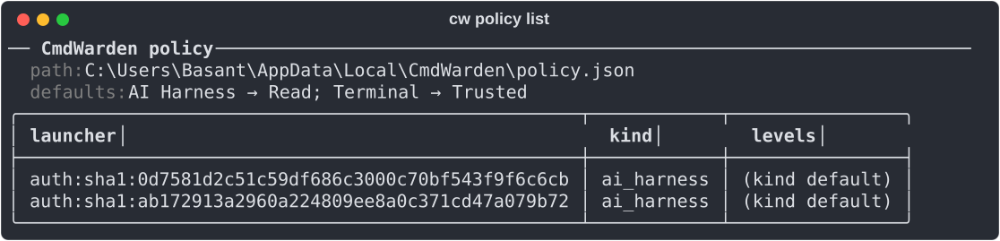
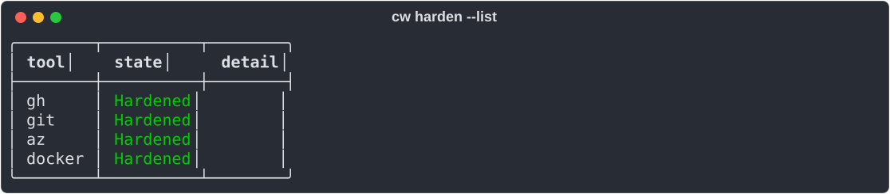
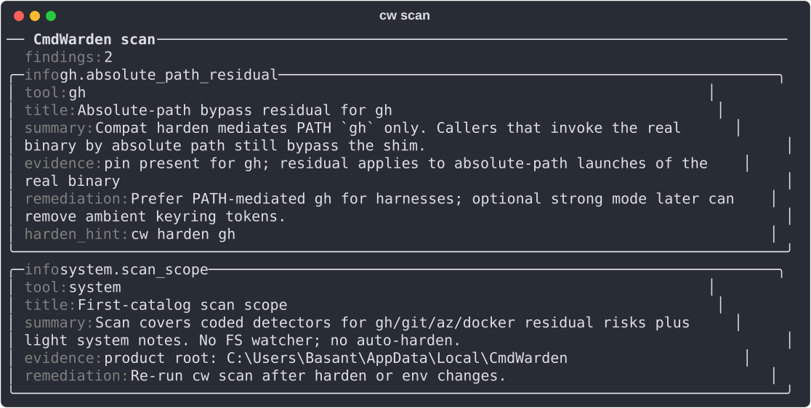
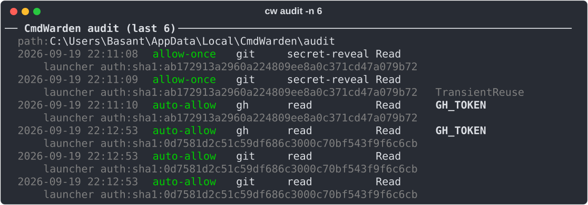

# CLI reference

Every command prints plain text. Colors turn off when you pipe the output or set `NO_COLOR`.

| Command | Role |
|---------|------|
| `cw version` | Product / CLI version |
| `cw doctor` | Session Agent health (lazy-start) |
| `cw agent start\|stop\|status` | Explicit agent control |
| `cw whoami` | Current launcher identity |
| `cw policy enroll --kind terminal\|ai-harness [--key …]` | Enroll launcher |
| `cw policy list` | Enrolled launchers + defaults |
| `cw policy set <key> <tool> <Deny\|Read\|Trusted\|Full>` | Per tool × launcher level; tool `"*"` sets every tool |
| `cw policy unenroll <key>` | Remove enrollment |
| `cw policy sessions [--revoke <id> \| --revoke-all]` | List or revoke active session allows |
| `cw policy hello off\|secret-reveal\|write-and-up` | When the Approval Gate asks for Windows Hello after Approve (default `secret-reveal`) |
| `cw harden gh\|git\|az\|docker` | Pin + PATH shim (+ gh token import) |
| `cw harden --list` | One row per catalog tool, same probe as `cw doctor` |
| `cw harden gh\|git\|docker --strong` | Also move the tool's stock credentials into the Vault |
| `cw unharden gh\|git\|docker` | Restore the stock store, remove pin and shim |
| `cw doctor --fix-path` | Put the shims dir first on the machine PATH (one UAC prompt) |
| `cw save <NAME>` / `cw delete <NAME>` | Named vault secret |
| `cw inject +NAME -- <cmd>` | Run cmd with secret in child env only |
| `cw scan` | Read-only residual risk scan |
| `cw launch claude\|codex\|cursor [-- args]` | Start an AI harness without the token variables `cw scan` knows; enroll its binary as ai-harness if needed |
| `cw leak-guard install\|uninstall claude\|cursor` | Hook that replaces vaulted secret values in tool output with `[CmdWarden: NAME]` |
| `cw canary install [--env <file>]...\|remove\|status` | Fake tokens that block the launcher and show an alarm when used |
| `cw audit [-n N]` | Recent gate decisions |
| `cw shortcut install [--desktop]\|remove\|status` | Start Menu (and Desktop) entry for CmdWarden Vault, plus a `cw launch` entry per harness on this PC |

## Screens

**`cw doctor`** - agent health, caller identity, and hardened tools.

**`cw whoami`** - the launcher identity for the current shell.

**`cw policy list`** - defaults and enrolled launchers.

**`cw harden --list`** - one row per catalog tool.

**`cw scan`** - residual risk findings.

**`cw audit -n 6`** - the newest gate decisions.

Regenerate these from a real terminal with `uv run scripts/render-cli-shots.py`.
