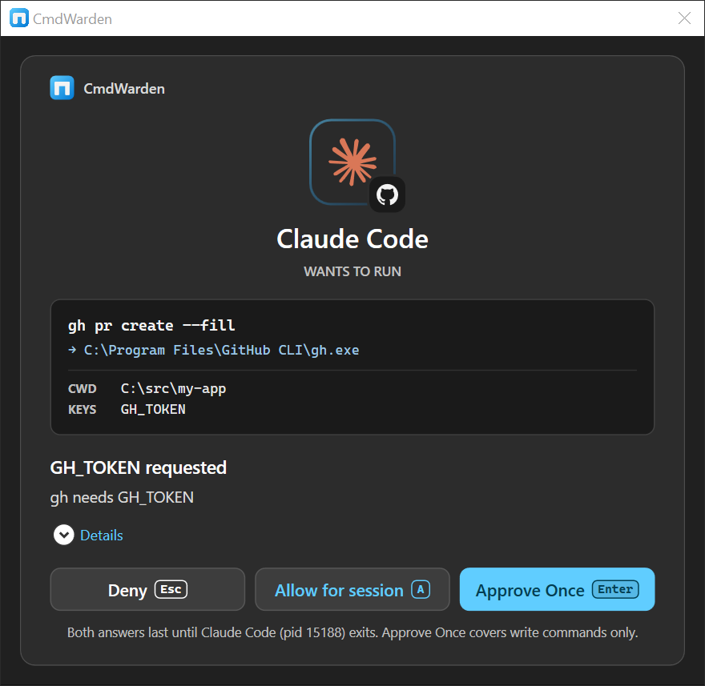
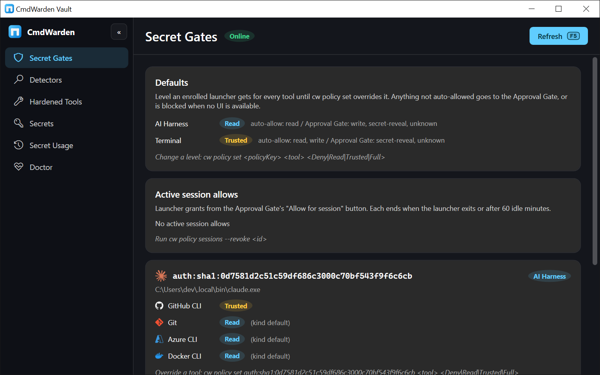

# CmdWarden

**Gate CLI secret use on Windows by tool and launcher.** Your terminal keeps working. An AI harness (Cursor, Claude Code, Codex) gets a policy and an approval card.

{ .hero }

<div class="grid cards" markdown>

-   :material-download:{ .lg .middle } **Install in one command**

    ---

    One PowerShell line installs the latest release as a global dotnet tool.

    [:octicons-arrow-right-24: Install](install.md)

-   :material-timer-outline:{ .lg .middle } **Set up in five minutes**

    ---

    Enroll your terminal, enroll the harness, harden `gh`. Done.

    [:octicons-arrow-right-24: Policy quick start](policy-quickstart.md)

-   :material-book-open-variant:{ .lg .middle } **Pick a use case**

    ---

    Nine short guides, from "gate my GitHub token" to "undo everything".

    [:octicons-arrow-right-24: Use cases](use-cases/index.md)

-   :material-robot-outline:{ .lg .middle } **Tell your agent the rules**

    ---

    Paste one block into `CLAUDE.md`, `.cursorrules`, or `AGENTS.md`.

    [:octicons-arrow-right-24: AI harness rules](prompts/ai-harness-rules.md)

</div>

## The problem

Your AI harness runs shell commands. Those commands call `gh`, `git`, `az`, or `docker` with **your** credentials. Without a gate, anything that can spawn a process on your machine can use the same tokens your terminal has.

## What CmdWarden does

- **Enroll** each launcher (your terminal, each AI harness) with a policy level: Deny, Read, Trusted, or Full.
- **Harden** `gh`, `git`, `az`, and `docker`. A PATH shim asks the Session Agent before the real tool runs.
- **Release** a secret only into the child process for one run. Nothing stays in the parent shell.
- **Ask you** with the Approval Gate card when policy does not auto-allow. No desktop means fail closed.
- **Show** everything in CmdWarden Vault: gates, detectors, hardened tools, secrets, usage, doctor.

## Install

```powershell
git clone https://github.com/BasantPandey/CmdWarden.git
cd CmdWarden
powershell -NoProfile -ExecutionPolicy Bypass -File .\scripts\Install-CmdWarden.ps1 -Desktop
```

The script installs the latest GitHub Release as a global dotnet tool and creates the CmdWarden Vault icons. Other install ways, update, and uninstall: [Install](install.md).

## First five minutes

```powershell
cw doctor
cw policy enroll --kind terminal      # in your normal terminal
cw policy enroll --kind ai-harness    # in the AI harness terminal
cw harden gh
```

Open a new terminal. `gh` now runs through CmdWarden. Your terminal is Trusted. The harness is Read. Everything else prompts you.


## Three surfaces

| Surface | What it is | When you see it |
|---------|------------|-----------------|
| **`cw` CLI** | Setup and power-user commands | You type them in a terminal |
| **Approval Gate** | Small desktop card with **Deny** / **Allow for session** / **Approve Once** | Pops up while a gated command waits |
| **CmdWarden Vault** | Desktop app with six pages: Secret Gates, Detectors, Hardened Tools, Secrets, Secret Usage, Doctor | You open it from the Start Menu |



## Requirements

Windows 10 or 11 with a desktop session, and the [.NET SDK 10](https://dotnet.microsoft.com/download). CmdWarden is written in C# and is open source on [GitHub](https://github.com/BasantPandey/CmdWarden).
