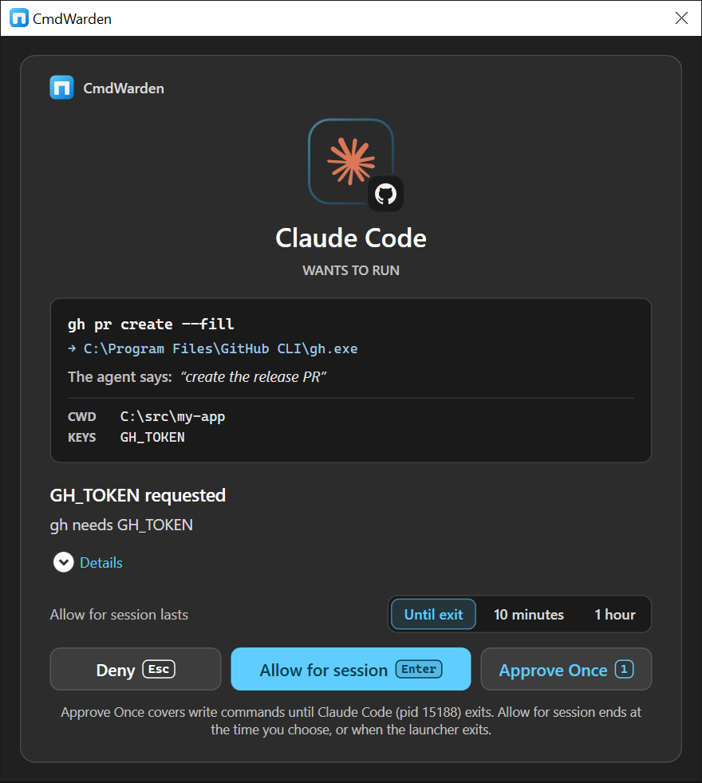
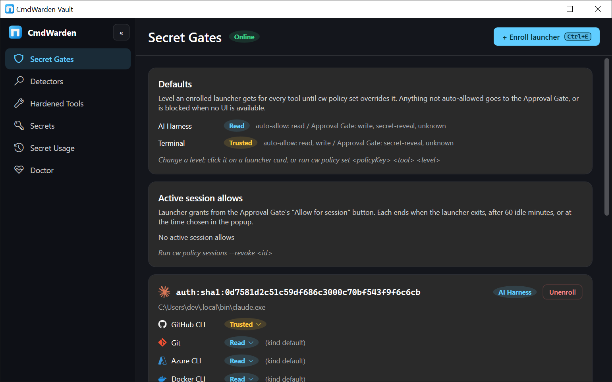
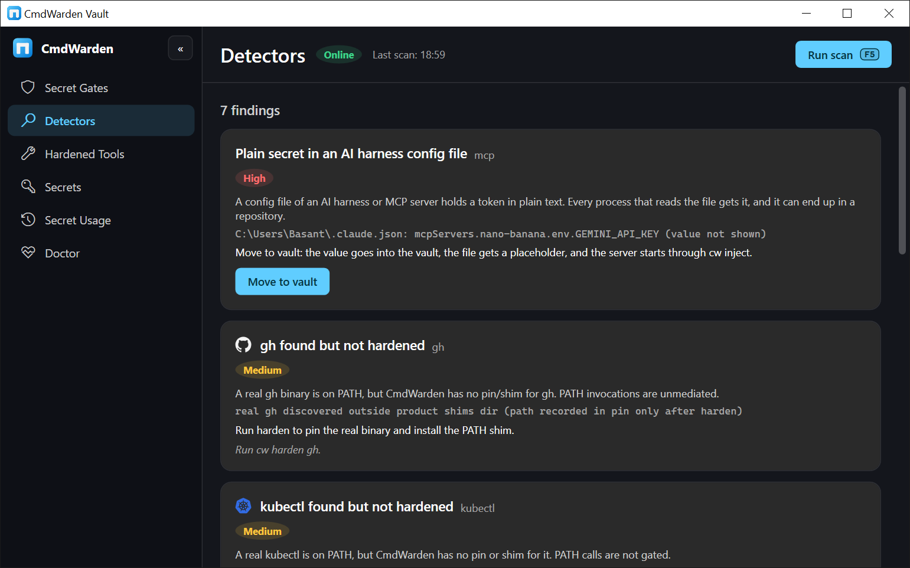
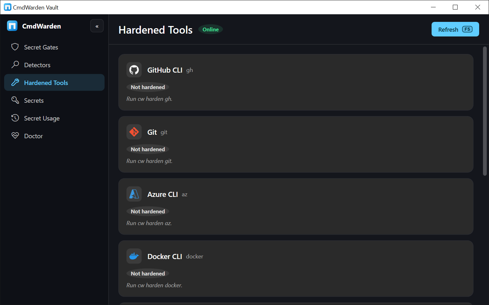
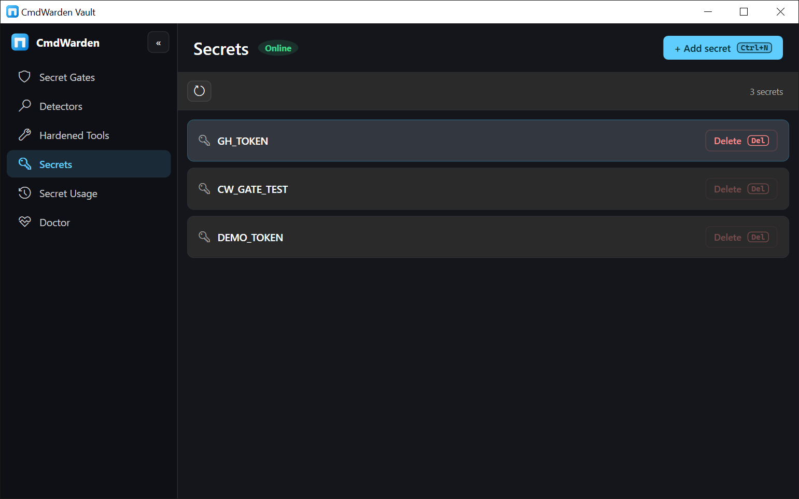
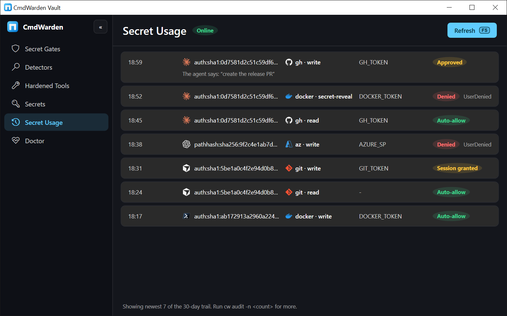
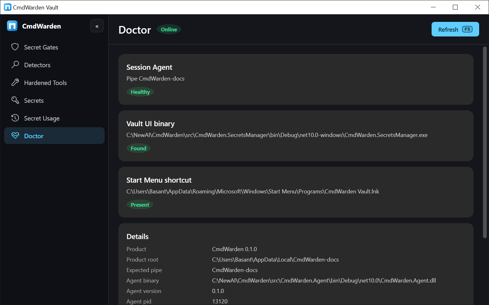

# Install CmdWarden

CmdWarden carries its own .NET runtime. You need no .NET install and no admin prompt. Commands: **`cw`** and **`cmdwarden`**.

| Section | Go there when |
|---------|---------------|
| [1. Requirements](#1-requirements) | You start from a clean machine |
| [2. Install](#2-install) | You install for the first time |
| [3. Set up](#3-set-up) | You protect your tools and your AI harness |
| [4. Verify](#4-verify) | You check the install |
| [5. What you get](#5-what-you-get) | You want to see the app before you set it up |
| [6. Other install ways](#6-other-install-ways) | You want the dotnet tool or a build from source |
| [7. Update](#7-update) | A new release is out |
| [8. Uninstall](#8-uninstall) | You remove CmdWarden |
| [9. Troubleshooting](#9-troubleshooting) | Something fails |

---

## 1. Requirements

| Need | Notes |
|------|-------|
| **Windows 10 or 11** | CmdWarden is Windows only. It needs a desktop session for the Approval Gate card. |
| **About 250 MB of disk** | The download is about 95 MB. Most of it is the .NET runtime that CmdWarden carries. |

Install alone changes nothing. `gh`, `git`, and the other tools run as before until you run `cw setup` or `cw harden`.

---

## 2. Install

Pick one way.

**Setup zip** (recommended):

1. Download `CmdWarden.<version>-setup.zip` from the [latest release](https://github.com/BasantPandey/CmdWarden/releases/latest).
2. Extract the zip, then double-click **`install.cmd`**. Do not run it as admin.

The installer copies CmdWarden to `%LOCALAPPDATA%\CmdWarden\app`, puts it on your user PATH, and adds **CmdWarden** to Windows Settings > Apps. When an older CmdWarden dotnet tool is there, it removes that copy. At the end it offers to run `cw setup`.

**Portable zip**: extract `CmdWarden.<version>-win-x64.zip` anywhere and run `.\cw.exe setup`.

**winget** (soon, [#64](https://github.com/BasantPandey/CmdWarden/issues/64)): the package is not in the winget catalog yet. When it is, run:

```powershell
winget install BasantPandey.CmdWarden
```

winget puts the install folder on your user PATH. Open a new terminal after the install.

---

## 3. Set up

Run this once, in **your own terminal**, not in the AI harness:

```powershell
cw setup
```

Each step asks first. Enter means yes. `cw setup --yes` runs every step with no questions.

| Step | What it does |
|------|--------------|
| terminal | Enrolls this terminal as Trusted. Your own work gets no card. |
| tools | Hardens each tool it finds: `gh`, `git`, `az`, `docker`, `npm`, `aws`, `kubectl`, and `ssh`. When a tool comes before the shims on the machine PATH, it fixes PATH with one admin prompt. |
| harnesses | Finds Claude Code, Cursor, and Codex. Enrolls each one at Read. Adds the policy hook, the leak guard, and the MCP server. For Codex, it also offers to enroll the sandbox accounts. |
| shortcuts | Adds the Start Menu entry, the tray icon at logon, and the Settings > Apps entry. |
| canary | Plants fake tokens. A use of one shows an alarm and blocks the app that used it. |
| protect | Turns on the secret protections that each harness has but leaves off. See [Trust](trust.md). |
| try | Runs `cw try`: a stand-in agent asks for a fake secret, and you see the real card. |

Then restart your AI harness, so it reads the new PATH and hooks. `cw setup` is safe to run again: a step that is done says so.

Run `cw try` at any time to see the card again. It never uses a real token.

---

## 4. Verify

Open a **new** terminal, then run:

```powershell
cw version
cw doctor
```

`cw doctor` starts the Session Agent when it is not running. State lives under `%LOCALAPPDATA%\CmdWarden\`.

Check the signatures of the installed files. A signed release shows `Valid` on each row:

```powershell
Get-ChildItem "$env:LOCALAPPDATA\CmdWarden\app" -Recurse -Include cw.exe, CmdWarden.*.exe |
  Get-AuthenticodeSignature | Format-Table Status, Path
```

The install folder holds these parts:

| Part | Role |
|------|------|
| `cw.exe`, `cmdwarden.exe` | CLI |
| `agent\` | Session Agent: policy, vault, audit, approval |
| `agent\approval-gate\` | Approval Gate card |
| `secrets-manager\` | CmdWarden Vault desktop app and tray icon |
| `shim-payload\` | PATH shims that `cw harden` installs |
| `try-agent\` | The stand-in agent of `cw try` |
| `runtime\` | The .NET runtime that every part uses |

A harden copies the shims to `%LOCALAPPDATA%\CmdWarden\shims` and the base runtime to `%LOCALAPPDATA%\CmdWarden\runtime`.

---

## 5. What you get

### Approval Gate

The card appears on your desktop when policy does not auto-allow a secret release. The command waits until you click **Deny**, **Allow for session**, or **Approve Once**. When the card offers **Allow for session**, it is the default: press **Enter**. Press **1** for Approve Once and **Esc** for Deny. The card offers it to an enrolled app, never for a secret read. Other cards show Deny and Approve Once (**Enter**).



### Tray icon

The CmdWarden tray icon shows how many cards you answered today, lists live session allows, revokes them, and tells you when CmdWarden blocks a retry or a canary use. See [Tray icon](vault.md#tray-icon).

### CmdWarden Vault

Open **CmdWarden Vault** from the Start Menu. Six pages. Every page is read-only except Secrets and Secret Gates. The app never shows a secret value.

**Secret Gates** - defaults per launcher kind, one card per enrolled launcher, and active session allows. Enroll with **Ctrl+E**, click a level to change it, and unenroll with **Del**.



**Detectors** - one card per residual risk, with evidence and the `cw` command that fixes it.



**Hardened Tools** - one card per catalog tool with its harden state.



**Secrets** - every secret name in the vault. Add with **Ctrl+N**. Select with the arrow keys and delete with **Del**. [All keys](vault.md#keys).



**Secret Usage** - the newest gate decisions with launcher, tool, secret name, and decision.



**Doctor** - agent health, binary and shortcut checks, and the details list.



---

## 6. Other install ways

### dotnet tool

For .NET developers. It needs the [.NET 10 SDK](https://dotnet.microsoft.com/download).

```powershell
dotnet tool install -g CmdWarden
cw setup
```

NuGet.org does not have CmdWarden yet ([#64](https://github.com/BasantPandey/CmdWarden/issues/64)). Until then, download `CmdWarden.<version>.nupkg` from the release into a folder and pass that folder: `dotnet tool install -g CmdWarden --add-source C:\packages`.

### Scoop

Each release has `CmdWarden.<version>-packages.zip` with a Scoop manifest. Put `scoop\cmdwarden.json` in a bucket, then run `scoop install cmdwarden`.

### From source

```powershell
git clone https://github.com/BasantPandey/CmdWarden.git
cd CmdWarden
pwsh ./scripts/Build-Portable.ps1 -Out artifacts/portable
.\artifacts\portable\cw.exe setup
```

The script builds every part and copies the .NET runtime of your SDK next to them. It ends with a check that `cw.exe` runs with no .NET on PATH.

### GitHub Actions artifact

Every green **build** on `main` uploads the portable folder. Open [Actions](https://github.com/BasantPandey/CmdWarden/actions), pick the latest run, download the artifact, extract it, and run `.\cw.exe`.

---

## 7. Update

| Install way | Update |
|-------------|--------|
| winget | `winget upgrade BasantPandey.CmdWarden` |
| Setup zip | `cw update` |
| dotnet tool | `dotnet tool update -g CmdWarden` |

```powershell
cw update --check   # only say if a newer release is available
cw update           # install the newest release
```

`cw update` reads the newest GitHub release and downloads its setup zip. It compares the sha256 of the zip with the digest that GitHub shows for the asset. A wrong or missing digest stops the update. Then the installer of the zip runs in a new window, and `cw` stops. The installer stops the Session Agent and replaces `%LOCALAPPDATA%\CmdWarden\app`. Your policy, vault, and shims stay.

---

## 8. Uninstall

Use one of these:

- Run `cw uninstall`. It runs the same uninstaller as Settings > Apps, in a new window.
- Open Windows **Settings > Apps**, select **CmdWarden**, and click **Uninstall**.
- Double-click **`uninstall.cmd`** from the setup zip.

For a winget install, run `cw uninstall` first. It removes the hooks and shims, then it runs `winget uninstall` for you. A plain `winget uninstall` removes only the files.

The uninstaller works when `cw` is broken or gone. Each step runs on its own. A failed step prints a warning, and the next step continues.

1. Unhardens every tool, so their logins go back to the stock stores.
2. Removes the hooks, MCP servers, and protections from Claude Code, Cursor, and Codex, and removes the canaries.
3. Stops the Session Agent, the Approval Gate, and CmdWarden Vault.
4. Removes the Start Menu entry and the Desktop icon.
5. Uninstalls an old dotnet tool copy.
6. Removes CmdWarden folders from the user PATH. For the machine PATH, it asks for one admin prompt.
7. Deletes `%LOCALAPPDATA%\CmdWarden`: policy, pins, shims, audit, and the app.
8. Asks before it deletes saved secrets from Credential Manager (`CmdWarden/...`). The default is to keep them.
9. Removes the entry in Settings > Apps, and the winget package when winget installed it.

Options:

```powershell
.\Uninstall-CmdWarden.ps1 -KeepData          # keep policy, pins, and audit, for a reinstall
.\Uninstall-CmdWarden.ps1 -RemoveSecrets     # also delete saved secrets
.\Uninstall-CmdWarden.ps1 -Quiet             # ask nothing; keep secrets; skip the admin PATH step
```

---

## 9. Troubleshooting

| Symptom | Fix |
|---------|-----|
| `cw` not found | Open a **new** terminal. PATH changes reach only new terminals. |
| SmartScreen warns about `install.cmd` | The release is not signed yet. Check the sha256 of the zip against the release page, then click **More info** > **Run anyway**. |
| `cw setup` skips the terminal step | You ran it inside an AI harness. Run it in your own terminal. |
| `cw doctor` says agent binary missing | The install folder is not complete. Install again. |
| `cw doctor` says pipe exists but access denied | An agent runs elevated or as another user. Run `cw agent stop` from that terminal, then `cw agent start` from a normal one. |
| No Approval Gate card | Check `agent\approval-gate\CmdWarden.ApprovalGate.exe` exists in the install folder. A missing card fails closed. |
| `cw` is broken and you want it gone | Run the uninstaller (section 8). It does not need a working `cw`. |

---

Next: [Policy quick start](policy-quickstart.md) · [Trust](trust.md) · [User guide](user-guide.md)
