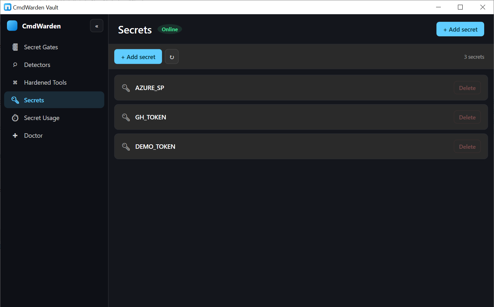
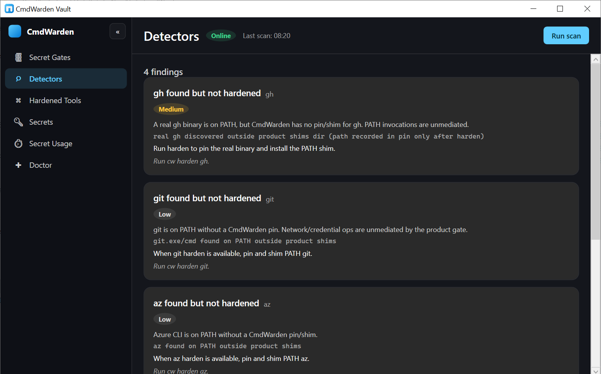
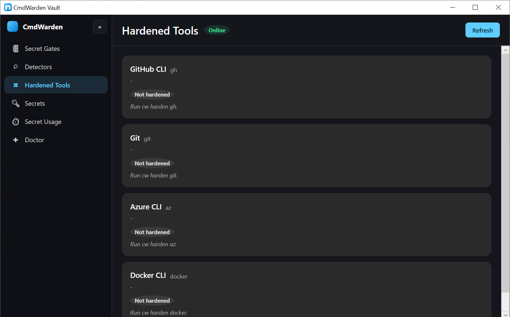
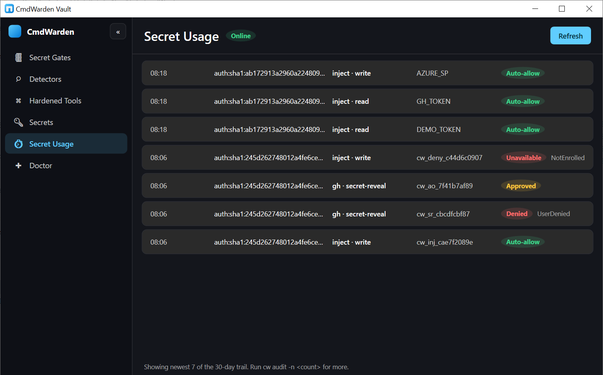
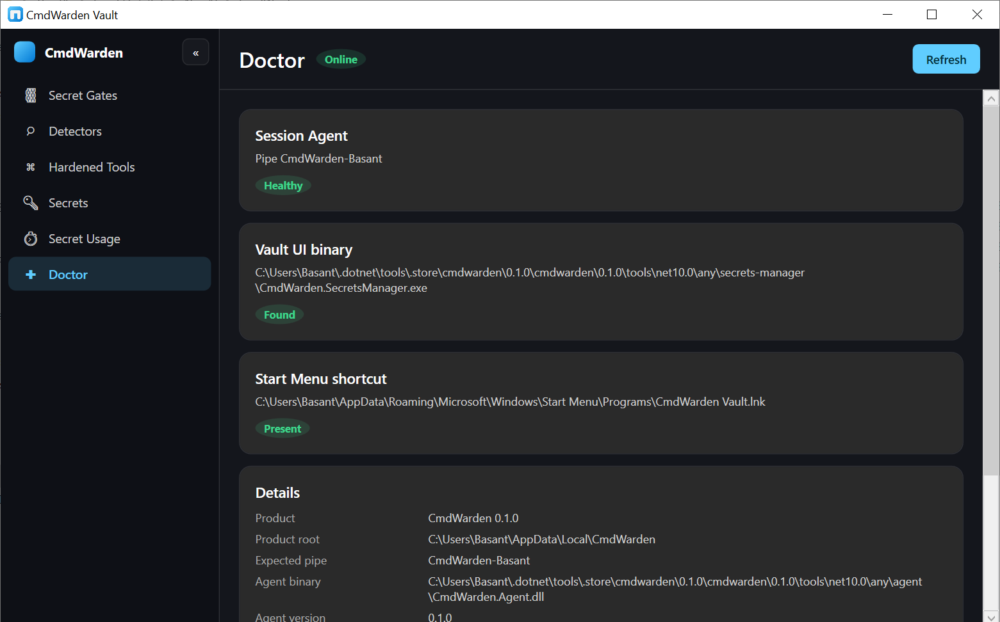

# CmdWarden user guide

For Windows developers who use AI harnesses (Cursor, Claude Code, Codex, and similar) and first-catalog CLIs (`gh`, `git`, `az`, `docker`). CLI: **`cw`** (alias `cmdwarden`). Desktop app: **CmdWarden Vault** (Start Menu). Domain terms: [CONTEXT.md](../CONTEXT.md).

## What problem this solves

Your AI harness can run shell commands. Those commands can call `gh`, `git`, `az`, or `docker` with **your** credentials - list private repos, open PRs, push code, talk to cloud APIs. Without a gate, anything that can spawn a process on your machine can often use the same tokens your terminal already has.

**CmdWarden** sits between the launcher (terminal or AI harness) and the hardened tool:

1. You **enroll** which launchers you trust, and how much.
2. You **harden** tools so PATH hits a **Shim** that asks the **Session Agent** first.
3. Secrets leave the **Vault** only into the **child** process for that run (when policy allows), not into every agent session forever.
4. When policy is unsure, you get an **Approval Gate** (Allow once / Deny). If the UI cannot show, the request **fails closed**.

Install is binaries only. Day-to-day you still type `gh` and `git` as usual after setup.

CmdWarden has three user surfaces:

| Surface | What it is | When you see it |
|---------|------------|-----------------|
| **`cw` CLI** | Setup and power-user commands | You type them in a terminal |
| **Approval Gate** | Small desktop card with **Deny** / **Allow for session** / **Approve Once** | Pops up while a gated command waits |
| **CmdWarden Vault** | Desktop app with six pages: Secret Gates, Detectors, Hardened Tools, Secrets, Secret Usage, Doctor | You open it from the Start Menu |

The [CmdWarden Vault](#cmdwarden-vault-desktop-app) section describes every page. Each use case below names the Vault page that shows the same information.

---

## Use cases (start here)

Want good defaults without reading UC1-UC6? See the [Policy quick start](policy-quickstart.md).

| # | Goal |
|---|------|
| **UC1** | First-time install → enroll → harden `gh` |
| **UC2** | **Story:** create a secret → mid-AI session the agent tries to **read** it → **Allow / Deny** popup |
| **UC3** | Agent Read vs write/secret-reveal needs click |
| **UC4** | Terminal Full, harness Read/Deny |
| **UC5** | One-shot `save` / `inject` / `delete` |
| **UC6** | Harden git / az / docker |
| **UC7** | Doctor / whoami / scan / audit |
| **UC8** | Unenroll / uninstall |
| **UC9** | Add and remove secrets in CmdWarden Vault (no CLI) |

### UC1 - First-time setup so AI cannot freely use my GitHub token

**When:** You use Cursor / Claude Code / Codex and also use `gh`. You want the agent constrained, while your own terminal stays productive.

**Outcome:** Terminal can do normal `gh` work (Trusted default). AI harness defaults to **Read** (list/view style); writes and secret-reveal need a prompt or a higher policy level.

```powershell
# 1. Install (see docs/install.md for latest / Release / update)
# Example: pack from this repo, then global tool
dotnet pack src/CmdWarden.Cli/CmdWarden.Cli.csproj -c Release -o .\artifacts\nupkg
dotnet tool install -g CmdWarden --add-source .\artifacts\nupkg --version 0.1.0

# 2. Health
cw doctor

# 3. Enroll YOUR normal shell (Windows Terminal / PowerShell - not inside the agent)
cw whoami
cw policy enroll --kind terminal

# 4. Enroll the AI harness (run these from that harness integrated terminal)
cw whoami
cw policy enroll --kind ai-harness

# 5. Harden gh (pin + PATH shim + import token into Vault as GH_TOKEN)
cw harden gh

# 6. New shell so PATH sees the shim, then verify
where.exe gh
gh auth status
cw policy list
```

*Expect:* `cw doctor` shows Session Agent UP; enrollments appear in `policy list`; first `gh` on PATH is under CmdWarden shims; agent-driven `gh` that needs more than Read may prompt or block depending on command class.

**Why two enrollments?** Policy is **tool + launcher**. Same `gh`, different caller (you vs agent) can get different levels.

---

### UC2 - Create a secret, then Allow/Deny when the AI tries to read it mid-session

**Story (this is the main “screens” use case):**

1. **Beginning (you):** create / save a named secret into the CmdWarden Vault.  
2. **Middle of an AI session:** you ask the agent to **read that same secret** (or run a command that needs it).  
3. **Popup:** the **Approval Gate** appears on the desktop with **Deny** and **Approve Once** - the agent is blocked until you click.

Saving does **not** show the popup. The popup appears only when something tries to **release / use** the secret under a policy that does not auto-allow (typical: **AI harness** at **Read**).

**Prerequisites:** CmdWarden installed ([install.md](install.md)), Windows desktop session, and an AI product (Cursor / Claude Code / Codex / …) that can run shell commands.

---

#### Part 1 - Beginning: set up and **create** the secret (no popup)

Do this in **your normal Windows Terminal / PowerShell** (not the AI chat).

```powershell
# 1) Agent health
cw doctor

# 2) Enroll this terminal as trusted
cw whoami
cw policy enroll --kind terminal

# 3) Create (save) a named secret - THIS DOES NOT show Allow/Deny
cw save DEMO_TOKEN --value "demo-not-a-real-secret"
# interactive alternative (hides typing):  cw save DEMO_TOKEN
```

*Expect:*

- `cw doctor` → Session Agent **UP**  
- Enroll → a **terminal** row in `cw policy list`  
- Save → secret stored as Credential Manager target `CmdWarden/secret/DEMO_TOKEN`  
- **No Approval Gate window** on save (you are only storing, not releasing)

**Without the CLI:** open **CmdWarden Vault** from the Start Menu, go to **Secrets**, click **+ Add secret**, type the name and value, click **Save**. See [UC9](#uc9---add-and-remove-secrets-in-cmdwarden-vault). The result is the same Credential Manager target.

Optional - prove **you** can read it from the terminal without a popup (Trusted terminal auto-allows inject/write):

```powershell
cw inject +DEMO_TOKEN -- cmd /c echo %DEMO_TOKEN%
# prints: demo-not-a-real-secret
# parent shell still does NOT keep DEMO_TOKEN in env
```

---

#### Part 2 - Enroll the AI harness (stricter: needs click to release secrets)

In the **AI product’s integrated terminal** (Cursor / Claude Code / Codex terminal panel):

```powershell
cw whoami
cw policy enroll --kind ai-harness
cw policy list
```

*Expect:* a second policy key with kind **ai-harness** (default tool level **Read**).  
Read does **not** auto-allow `inject` (class **write**) or `gh` **secret-reveal** - those need the Approval Gate.

Give the harness the rules in [docs/prompts/ai-harness-rules.md](prompts/ai-harness-rules.md). Paste them into its rules file (`CLAUDE.md`, `.cursorrules`, `AGENTS.md`).

---

#### Part 3 - Middle of the AI session: agent tries to **read** that secret → **popup**

Stay in the AI product. In the **chat**, ask something that makes the agent run **inject for the secret you created**, for example:

> Run this in the terminal and show me the output:  
> `cw inject +DEMO_TOKEN -- cmd /c echo %DEMO_TOKEN%`

What happens next:

1. The agent starts the tool call (shell command).  
2. CmdWarden Session Agent evaluates: **launcher = AI harness**, **tool = inject**, **secret name = DEMO_TOKEN**.  
3. Policy does **not** auto-allow → the **Approval Gate** opens as a **Windows desktop popup** (Fluent-style card), while the agent is still mid-run and waiting.  
4. The popup shows the launcher, the command, the **CWD**, and **KEYS: DEMO_TOKEN**. It shows the secret **name** only, never the value.

   

5. You choose:

   | You click | Result in the AI session |
   |-----------|---------------------------|
   | **Approve Once** | This one read is allowed; the child can use `DEMO_TOKEN`; agent can continue. Next gated read can prompt again. |
   | **Allow for session** | This read and every later read of the same class (or lower) for this tool and secret are allowed. The grant ends when the launcher process exits or after 60 idle minutes. The button is hidden for unenrolled launchers. It never covers secret-reveal. |
   | **Deny** | Release is blocked; agent sees failure / permission denied. |
   | Close the window | Same as unavailable → **fail closed** (block). |

   Every decision appears on the **Secret Usage** page of CmdWarden Vault and in `cw audit`. Active session grants appear on the **Secret Gates** page. Revoke one with `cw policy sessions --revoke <id>`.

**Important:** The Allow/Deny UI is a **separate OS window** on the desktop, not a message inside the chat. It appears **during** the agent step that tries to read the secret - that is the “middle of the AI session” moment.

Cleanup when you are done experimenting:

```powershell
cw delete DEMO_TOKEN
```

---

#### Same idea with GitHub (`gh`) instead of a custom name

If you prefer GitHub’s token rather than `DEMO_TOKEN`:

```powershell
# Beginning (your terminal) - after enroll terminal + ai-harness as above
cw harden gh
# open a new shell so PATH uses the CmdWarden shim
where.exe gh
```

Then mid-AI session, ask the agent e.g.:

> Run `gh auth token` and show me the result.

That is a **secret-reveal** class command under **Read** for the harness → same **Approve Once / Deny** popup, with **keys** showing `GH_TOKEN` (name only).

---

#### If the popup does not appear

```powershell
cw doctor
cw whoami          # from the same place the agent runs commands
cw policy list
cw audit -n 20
```

Check that:

- Harness is enrolled as **ai-harness** (not the same key as terminal).  
- The command actually goes through CmdWarden (`cw inject …` or shimmed `gh`).  
- Approval helper exists: `agent\approval-gate\CmdWarden.ApprovalGate.exe` under the tool install.  
- Missing helper → **fail closed** (no silent allow), not a chat-only error.

The **Doctor** and **Secret Gates** pages of CmdWarden Vault show the same agent state and enrollments without a terminal.

---

### UC3 - Agent can list GitHub, but token export / PR create needs Allow or Deny

**When:** AI harness is enrolled as `ai-harness` (default **Read**). Safe **read** `gh` may auto-allow; **secret-reveal** / **write** should show the same Approval Gate popup as UC2 Part 3.

```powershell
cw policy list
cw whoami
cw policy set <harnessPolicyKey> gh Read
```

Then in the AI product, ask the agent to run e.g. `gh auth token` or `gh pr create …`. Answer **Deny** or **Approve Once** on the desktop card.

*Expect:* read-class may auto-allow under Read; write / secret-reveal → Approval Gate or block.

**If everything always prompts:** check enrollment (`cw whoami`, `cw policy list`) - unenrolled launchers never auto-allow.

---

### UC4 - I trust my terminal fully for `gh`, not the agent

**When:** You want maximum friction for the harness and less for yourself.

```powershell
# From terminal after enroll + harden:
cw whoami
cw policy set <terminalPolicyKey> gh Full

# From harness identity (or use key from when you enrolled the harness):
cw policy set <harnessPolicyKey> gh Read
# or stricter:
cw policy set <harnessPolicyKey> gh Deny
```

*Expect:* terminal-key rows allow more; harness-key stays Read or Deny. Levels: **Deny**, **Read**, **Trusted**, **Full**.

---

### UC5 - One-shot secret for a script without putting it in my profile

**When:** You need a password/API key in **one** child process (deploy script, curl, custom tool) and do not want it in `.env` committed or permanently in the parent shell.  
**Also see UC2 Part 1** for the same save/inject tour with expected screens, and **UC9** for the desktop way to save and delete.

```powershell
cw save MY_API_KEY
# paste when prompted (or: cw save MY_API_KEY --value "…")

cw inject +MY_API_KEY -- cmd /c my-tool.exe --use-env
cw delete MY_API_KEY
```

*Expect:* secret stored as Credential Manager target `CmdWarden/secret/MY_API_KEY`; inject puts it **only in the child** env; parent shell does not keep it. Inject is policy-gated (you need an enrolled launcher that allows it).

**Prefer UC1 for `gh`:** do not use inject as a substitute for `cw harden gh` when the goal is gated GitHub CLI.

---

### UC6 - Gate `git` / `az` / `docker` the agent might run

**When:** The harness runs `git push`, `az …`, or `docker …` and you want those invocations mediated (approve/deny by launcher), even if CmdWarden does not own the ambient credential store.

```powershell
cw harden git
cw harden az
cw harden docker
# open a new shell, then use tools via PATH
where.exe git
where.exe az
where.exe docker
```

*Expect:* PATH shims installed; **no** automatic vault import for git/az (GCM / MSAL stay). Docker optional: if you already `cw save DOCKER_AUTH_CONFIG`, child may get that on allow.

| Tool | Harden does | Day-to-day secret behavior |
|------|-------------|----------------------------|
| **gh** | Pin + shim + import **GH_TOKEN** into Vault | Child gets `GH_TOKEN` when allowed |
| **git** | Pin + shim | Gate only; GCM / helpers still ambient |
| **az** | Pin + shim | Gate only; MSAL `~/.azure` still ambient |
| **docker** | Pin + shim | Gate; optional vault `DOCKER_AUTH_CONFIG` if you saved it |

#### Strong mode for docker

**When:** You want Docker registry credentials out of the Docker Desktop / wincred store and behind the Approval Gate.

```powershell
cw harden docker --strong
cw doctor
cw unharden docker
```

*Expect:* `--strong` moves every `Docker Credentials` entry and every inline `auths` value into the vault, erases the originals, and sets `credsStore` to `cmdwarden` in `config.json`. `docker pull` and `docker login` then talk to `docker-credential-cmdwarden.exe`, which asks the Session Agent. A different value already in the vault stops the harden before any change. Foreign `credHelpers` (for example `gcloud`) stay and print a warning. `cw doctor` shows `Hardened (strong - N registries in vault)`; it shows Degraded when Docker Desktop rewrites `credsStore` or a legacy entry returns, and `cw harden docker --strong` repairs both. `cw unharden docker` writes the entries back, restores `credsStore`, and removes the pin, shim, and helper.

#### Strong mode for gh

**When:** You want every gh token out of the stock gh store and behind the Approval Gate, absolute-path `gh` included.

```powershell
cw harden gh --strong
cw doctor
cw unharden gh
```

*Expect:* `--strong` moves every stock entry (`gh:<host>:<user>` in Credential Manager, `oauth_token` lines in `hosts.yml`) into the vault as `CmdWarden/gh/<host>` and `CmdWarden/gh/<user>@<host>`, verifies each token with the real `gh`, then erases the originals. `hosts.yml` keeps the user list, active user, and `git_protocol`. `gh pr list` through the shim gets `GH_TOKEN` for github.com and `GH_ENTERPRISE_TOKEN` for the one GHES host, or the host `--hostname`, `-R host/owner/repo`, or `GH_HOST` names. `gh auth login` through the shim lands in the vault; absolute-path `gh auth token` reports not logged in. `cw doctor` shows `Hardened (strong - N hosts, M accounts in vault)`; it shows Degraded when a stock entry returns or a host has no vault token for its active user. `cw unharden gh` writes the entries back and removes the pin and shim; the compat `GH_TOKEN` stays. Known limit: `gh auth switch` reads the stock store and fails in strong mode; log in again through the shim instead.

#### Strong mode for git

**When:** You want Git HTTPS credentials out of Git Credential Manager and behind the Approval Gate.

```powershell
cw harden git --strong
cw doctor
cw unharden git
```

*Expect:* `--strong` moves every GCM entry (`git:*` in Credential Manager) into the vault, erases the originals, and makes `git-credential-cmdwarden.exe` the only global `credential.helper`. Host-scoped helper lines from `gh auth setup-git` are saved and removed. The harden stops before any change when `credential.credentialStore` is `dpapi` or `plaintext`, when `~\.git-credentials` exists, or when the vault holds a different value. `cw doctor` shows `Hardened (strong - N git hosts in vault)`; it shows Degraded when the helper list changes, a gh helper line returns, or a GCM entry returns, and `cw harden git --strong` repairs all three. `cw unharden git` restores the helper lines, writes the entries back to GCM, and removes the pin, shim, and helper.

---

### UC7 - Something feels wrong; audit and scan

**When:** A command was blocked, you are not sure the shim is active, or you suspect leftover env tokens.

```powershell
cw doctor
cw whoami
cw policy list
cw scan
cw audit
cw audit -n 20
```

*Expect:* doctor = agent health; whoami = which launcher CmdWarden sees; scan = residual risks (e.g. ambient tokens, PATH issues) without printing secrets; audit = recent allow/deny decisions (including Approval Gate Deny / Approve Once).

**In CmdWarden Vault:** **Doctor** = `cw doctor`, **Hardened Tools** = `cw harden --list`, **Detectors** = `cw scan`, **Secret Usage** = `cw audit`, **Secret Gates** = `cw policy list` + `cw policy sessions`. The Detectors page scans the app's own environment. Run `cw scan` in a terminal to check that terminal's variables.

---

### UC8 - Undo or step back

**When:** You want to remove a launcher from policy or stop using the tool package.

```powershell
cw policy list
cw policy unenroll <policyKey>
dotnet tool uninstall -g CmdWarden
```

*Expect:* unenroll removes that launcher’s policy row. Uninstall removes the global tool; data under `%LOCALAPPDATA%\CmdWarden\` (policy, pins, shims, audit) may remain until you delete that folder yourself. Run `cw shortcut remove` first to remove the Start Menu entry.

---

### UC9 - Add and remove secrets in CmdWarden Vault

**When:** You want to store a named secret, or remove one, without the terminal.

1. Open **CmdWarden Vault** from the Start Menu or the Desktop icon. If both are missing, run `cw shortcut install --desktop` once.
2. The app opens on the **Secrets** page. The badge next to the title shows the Session Agent state.
3. Click **+ Add secret**. Type the **Name** and the **Value**. Click **Save**.
4. The new name appears as a card. The value is never shown again.
5. To delete: click the card to select it, then click **Delete** on that card. Confirm with **Delete** in the dialog.



*Expect:* the same Credential Manager target as `cw save` (`CmdWarden/secret/<NAME>`). The list refreshes on its own every few seconds. A yellow banner **Session Agent not running - actions disabled** means the agent is down; run `cw doctor` in a terminal. A banner that says **denied access** means the agent runs elevated. Stop it from an admin shell, then start it from a normal shell.

Saving in the Vault does **not** show the Approval Gate. The gate appears only when a launcher tries to **release** the secret ([UC2 Part 3](#part-3---middle-of-the-ai-session-agent-tries-to-read-that-secret--popup)).

---

## Install (reference)

Install, verify, update, and uninstall: **[install.md](install.md)**. Install is binaries only. No tool shim goes on PATH until you run `cw harden`.

---

## CmdWarden Vault (desktop app)

CmdWarden Vault is a Windows desktop window. It reads the same policy file, vault, and audit trail as the CLI. It never shows a secret value. Open it from the Start Menu entry **CmdWarden Vault** or the Desktop icon.

```powershell
cw shortcut status              # where each shortcut is, and if it exists
cw shortcut install             # create the Start Menu entry
cw shortcut install --desktop   # create the Start Menu entry and the Desktop icon
cw shortcut remove              # delete both
```

Run `cw shortcut install` again after every reinstall of the tool. The shortcuts point at the exe inside the tool folder.

### Window layout

- **Left nav:** six page buttons. Click **«** or press **[** / **]** to collapse the nav to an icon rail.
- **Title bar:** page name, a **Session Agent** badge (Up / Agent down), and one primary button (**+ Add secret** on Secrets, **Run scan** on Detectors, **Refresh** elsewhere).
- **Body:** the page content. Every page is read-only except Secrets.

### Pages

| Page | Shows | CLI twin |
|------|-------|----------|
| **Secret Gates** | **Defaults** card: the level each launcher kind gets (AI Harness → Read, Terminal → Trusted). One card per enrolled launcher: kind pill, policy key, path, and which command classes auto-allow or go to the Approval Gate. **Active session allows** card: every live "Allow for session" grant with granted, last used, and expires times. | `cw policy list`, `cw policy sessions` |
| **Detectors** | Residual risk findings: title, tool, severity pill, summary, evidence, and remediation. Empty state: **Nothing to fix**. | `cw scan` |
| **Hardened Tools** | One card per catalog tool (`gh`, `git`, `az`, `docker`): pinned path and a pill **Hardened**, **Degraded**, or **Not hardened** with the reason. Strong mode shows in the note. | `cw harden --list`, `cw doctor` |
| **Secrets** | Every secret name in the vault. **+ Add secret** opens a dialog. **Delete** on a selected card asks for confirmation. | `cw save`, `cw delete` |
| **Secret Usage** | Recent gate decisions: time, launcher, tool · class, secret name, decision pill (**Auto-allow**, **Approved**, **Session granted**, **Session allow**, **Denied**), and reason code. | `cw audit` |
| **Doctor** | Cards for **Session Agent** (pipe, version), **Vault UI binary**, **Start Menu shortcut**, and a **Details** list. A **Version mismatch** pill means the agent binary is older than the app. | `cw doctor` |

### Screens

**Secret Gates** - defaults per launcher kind, one card per enrolled launcher, and active session allows.


**Detectors** - one card per finding with severity, evidence, and the `cw` command that fixes it.



**Hardened Tools** - one card per catalog tool with its harden state.



**Secret Usage** - the newest gate decisions with launcher, tool, secret name, and decision pill.



**Doctor** - agent health, binary and shortcut checks, and the details list.



### What the Vault does not do

- It does not enroll launchers or set policy levels. Use `cw policy enroll` and `cw policy set`.
- It does not harden tools. Use `cw harden`.
- It does not revoke session allows. Use `cw policy sessions --revoke <id>`.
- It does not show the Approval Gate. That card comes from the Session Agent when a gated command runs.

Each page prints the CLI command for the action it cannot do.

---

## Concepts you need for the use cases

| Idea | Plain meaning |
|------|----------------|
| **Session Agent** | Background process per user that evaluates policy and can show the Approval Gate |
| **Launcher** | Who started the tool (terminal vs AI harness), from the process chain |
| **Enroll** | Register a launcher as terminal or ai-harness so defaults apply |
| **Harden** | Opt-in: pin real binary + PATH shim (+ vault token for `gh`) |
| **Policy level** | Deny / Read / Trusted / Full for a **tool × launcher** pair |
| **Approval Gate** | Desktop **Deny / Approve Once** card when auto-allow does not apply (appears while the agent tool call waits) |
| **Vault** | Secrets in Windows Credential Manager, released only to allowed children |
| **CmdWarden Vault** | Desktop app (Start Menu) to view gates, detectors, hardened tools, secret names, usage, and doctor |
| **Session allow** | An Approval Gate grant that lasts until the launcher exits or 60 idle minutes |

Enrollment is by **identity key** from `cw whoami`, not by brand name. Cursor, Claude Code, and Codex are examples of the **ai-harness** kind - same enroll commands for each.

Escape if `whoami` is wrong or unknown:

```powershell
cw policy enroll --kind ai-harness --key <policyKey>
```

Agent lifecycle:

```powershell
cw doctor
cw agent start
cw agent status
cw agent stop
```

Many commands lazy-start the agent; prefer `cw doctor` after install.

---

## Day-to-day (after UC1)

1. Use `gh` / `git` / … **via PATH** in a **new shell** after harden (not absolute path to the real binary - that bypasses the shim).
2. Work normally. When the Approval Gate appears, click **Approve Once**, **Allow for session**, or **Deny**.
3. Tighten with `cw policy set` only when defaults are not enough (UC3).
4. Periodically open CmdWarden Vault (**Detectors**, **Secret Usage**) or run `cw scan` / `cw audit` (UC7).

Secrets reminder:

- **Track A (preferred for gh):** harden owns `GH_TOKEN` in the Vault; child-only release.
- **Track B:** `cw save` / `inject` / `delete`, or the Vault **Secrets** page, for named one-shot secrets (UC5, UC9).
- **Not for this:** browser passwords, full keychain UI, enterprise cloud secret managers.

---

## When something breaks

1. **Session Agent down** - `cw doctor` / `cw agent status` → `cw agent start` (reinstall tool if agent binary missing). CmdWarden Vault shows a yellow **Session Agent not running** banner and disables actions.
   If the detail says **pipe exists but denied access**, an agent runs elevated or as another user. That happens when an admin terminal ran `cw`. Stop that agent from an admin shell (`cw agent stop`), then run `cw agent start` from a normal shell. A normal Vault window cannot reach an elevated agent, and an elevated Vault window cannot reach a normal one.
2. **Always blocked / no Approval Gate** - `cw whoami`, `cw policy list` → enroll; use interactive desktop for the Gate.
3. **Tool skips CmdWarden** - `where.exe gh`, `cw scan` → new shell; PATH not absolute real binary; re-`cw harden …`.
   `cw doctor` and `cw harden --list` show `Degraded - shim not first on PATH: <entry> (machine|user) precedes shims` when a real tool sits before the shims dir. A machine entry needs `cw doctor --fix-path`: one UAC prompt prepends `%LOCALAPPDATA%\CmdWarden\shims` to the machine PATH as `REG_EXPAND_SZ`, checks the logon PATH expands it (else it writes the literal path), and prints `shims first on PATH (machine)`. Open a new terminal after the fix. Doctor prints `info: this terminal started before the last PATH change; open a new terminal` when this shell has an old PATH copy.
4. **Auth fails after harden (gh)** - `cw audit` → re-`cw harden gh`; do not rely on ambient parent-shell `GH_TOKEN` for the gated path.
5. **Vault app missing from Start Menu or Desktop** - `cw shortcut status` → `cw shortcut install --desktop`. If it reports **Vault UI binary not found**, repack so `secrets-manager\` sits next to `cw`, or set `CW_SECRETS_MANAGER_PATH`. If `cw` says **Unknown command: shortcut**, the installed tool is old; rebuild and reinstall ([install.md](install.md), Option B).
6. **Undo** - UC8.

---

## Command cheatsheet

| Command | Role |
|---------|------|
| `cw version` | Product / CLI version |
| `cw doctor` | Session Agent health (lazy-start) |
| `cw agent start\|stop\|status` | Explicit agent control |
| `cw whoami` | Current launcher identity |
| `cw policy enroll --kind terminal\|ai-harness [--key …]` | Enroll launcher |
| `cw policy list` | Enrolled launchers + defaults |
| `cw policy set <key> <tool> <Deny\|Read\|Trusted\|Full>` | Per tool × launcher level; tool `"*"` sets every tool |
| `cw policy unenroll <key>` | Remove enrollment |
| `cw policy sessions [--revoke <id> \| --revoke-all]` | List or revoke active session allows |
| `cw harden gh\|git\|az\|docker` | Pin + PATH shim (+ gh token import) |
| `cw harden --list` | One row per catalog tool, same probe as `cw doctor` |
| `cw harden gh\|git\|docker --strong` | Also move the tool's stock credentials into the Vault |
| `cw unharden gh\|git\|docker` | Restore the stock store, remove pin and shim |
| `cw doctor --fix-path` | Put the shims dir first on the machine PATH (one UAC prompt) |
| `cw save <NAME>` / `cw delete <NAME>` | Named vault secret |
| `cw inject +NAME -- <cmd>` | Run cmd with secret in child env only |
| `cw scan` | Read-only residual risk scan |
| `cw audit [-n N]` | Recent gate decisions |
| `cw shortcut install [--desktop]\|remove\|status` | Start Menu (and Desktop) entry for CmdWarden Vault |

---

**Related:** [Install](install.md) · [Policy quick start](policy-quickstart.md) · [AI harness rules](prompts/ai-harness-rules.md) · [CONTEXT.md](../CONTEXT.md) · [Architecture](spec/cmdwarden.md)
