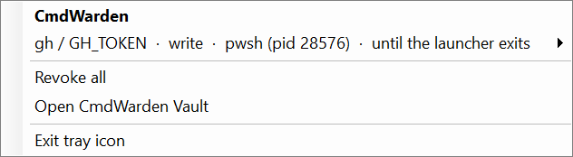
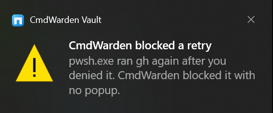
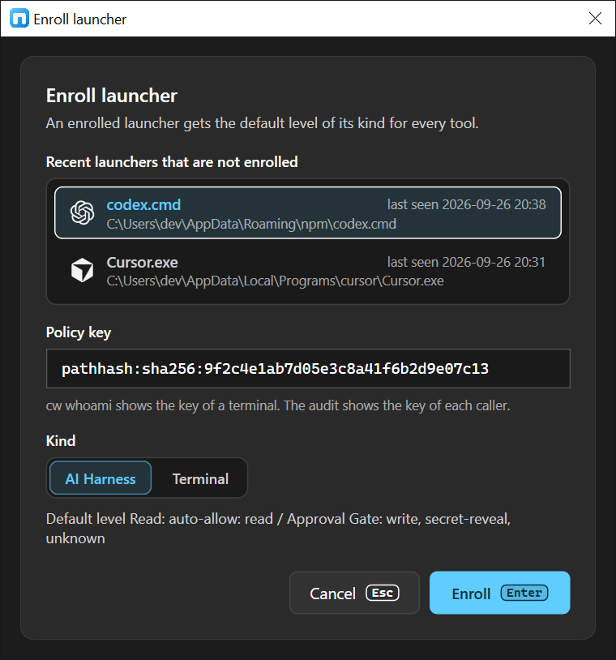
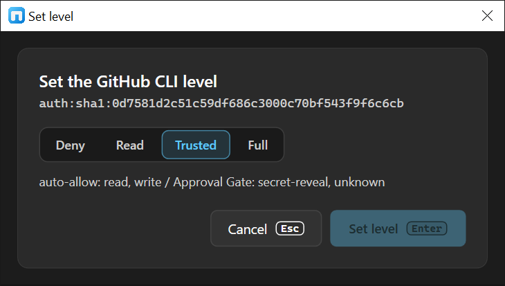
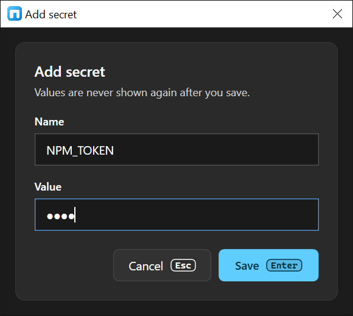
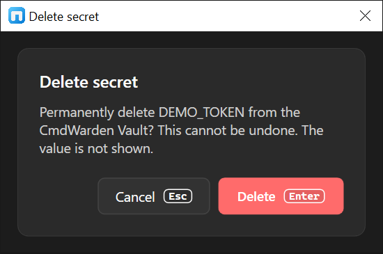

# CmdWarden Vault desktop app

CmdWarden Vault is a Windows desktop window. It reads the same policy file, vault, and audit trail as the CLI. It never shows a secret value. Open it from the Start Menu entry **CmdWarden Vault** or the Desktop icon.

```powershell
cw shortcut status              # where each shortcut is, and if it exists
cw shortcut install             # create the Start Menu entry and start the tray icon at logon
cw shortcut install --desktop   # also create the Desktop icon
cw shortcut remove              # delete the Start Menu, Desktop, and logon entries
```

Run `cw shortcut install` again after every reinstall of the tool. The shortcuts point at the exe inside the tool folder.

## Tray icon

The CmdWarden tray icon runs from logon. `cw shortcut install` adds it to the Startup folder and starts it. Click the icon to open its menu:

- One row per live session allow: tool, secret name, class, launcher process, and when it ends. Point at a row and click **Revoke** to end that grant.
- **Revoke all** ends every session allow, the same as `cw policy sessions --revoke-all`.
- **Open CmdWarden Vault** opens the window.
- **Exit tray icon** closes the icon until the next logon.



The icon also shows a notification when CmdWarden blocks a launcher with no popup:

- A launcher runs a tool again after you denied it, and the deny cooldown blocks the retry.
- A launcher uses a canary token.



The tray icon shows one notification per launcher and tool each minute, so a retry loop does not fill the screen.

## Window layout

- **Left nav:** six page buttons. Click **«** or press **[** / **]** to collapse the nav to an icon rail.
- **Title bar:** page name, a **Session Agent** badge (Up / Agent down), and one primary button (**+ Add secret** on Secrets, **Run scan** on Detectors, **Refresh** elsewhere).
- **Body:** the page content. Every page is read-only except Secrets and Secret Gates.

## Keys

Each button shows its key next to its label.

| Key | Where | Does |
|-----|-------|------|
| **F5** | Every page | Refresh the page. On Detectors, run a scan. |
| **Ctrl+N** | Secrets | Open **Add secret**. |
| **Down** / **Up** | Secrets | Select the next or the previous card. |
| **Del** | Secrets | Delete the selected card. A dialog asks you first. |
| **Esc** | Secrets | Clear the selection. |
| **Ctrl+E** | Secret Gates | Open **Enroll launcher**. |
| **Del** | Secret Gates | Unenroll the selected launcher. A dialog asks you first. |
| **Esc** | Secret Gates | Clear the selection. |
| **[** / **]** | Every page | Collapse or expand the nav. |
| **Enter** | Add secret, Delete secret, Enroll launcher, Set level, Unenroll launcher | **Save**, **Delete**, **Enroll**, **Set level**, or **Unenroll**. |
| **Esc** | Every dialog | **Cancel**. Nothing changes. |

## Pages

| Page | Shows | CLI twin |
|------|-------|----------|
| **Secret Gates** | **Defaults** card: the level each launcher kind gets (AI Harness → Read, Terminal → Trusted). One card per enrolled launcher: kind pill, policy key, path, and which command classes auto-allow or go to the Approval Gate. **Active session allows** card: every live "Allow for session" grant with granted, last used, expires, and end times. Enroll a launcher, set a level, or unenroll a launcher. | `cw policy list`, `cw policy sessions`, `cw policy enroll`, `cw policy set`, `cw policy unenroll` |
| **Detectors** | Residual risk findings: title, tool, severity pill, summary, evidence, and remediation. Empty state: **Nothing to fix**. | `cw scan` |
| **Hardened Tools** | One card per catalog tool (`gh`, `git`, `az`, `docker`): pinned path and a pill **Hardened**, **Degraded**, or **Not hardened** with the reason. Strong mode shows in the note. | `cw harden --list`, `cw doctor` |
| **Secrets** | Every secret name in the vault. **+ Add secret** opens a dialog. **Delete** on a selected card asks for confirmation. | `cw save`, `cw delete` |
| **Secret Usage** | Recent gate decisions: time, launcher, tool · class, secret name, decision pill (**Auto-allow**, **Approved**, **Session granted**, **Session allow**, **Denied**), and reason code. | `cw audit` |
| **Doctor** | Cards for **Session Agent** (pipe, version), **Vault UI binary**, **Start Menu shortcut**, and a **Details** list. A **Version mismatch** pill means the agent binary is older than the app. | `cw doctor` |

## Screens

**Secret Gates** - defaults per launcher kind, one card per enrolled launcher, and active session allows.


**Enroll launcher** - click **+ Enroll launcher** or press **Ctrl+E**. Pick a launcher that the audit saw, or type a policy key. Choose **AI Harness** or **Terminal**, then press **Enter**.



**Set level** - click the level of a tool on a launcher card. Choose **Deny**, **Read**, **Trusted**, or **Full**, then press **Enter**.



**Unenroll** - click **Unenroll** on a launcher card. Or select the card with a click and press **Del**. Press **Enter** to unenroll or **Esc** to keep it.

Each change writes the same policy file as `cw policy`. The Session Agent reads the change on its next call. It then drops the session allows and remembered answers of that launcher and tool, the same as after a `cw policy` command.

**Detectors** - one card per finding with severity, evidence, and the `cw` command that fixes it.


**Hardened Tools** - one card per catalog tool with its harden state.


**Secrets** - every secret name. Select a card with a click or the arrow keys, then click **Delete** or press **Del**.


**Add secret** - type a name and a value. Press **Enter** to save or **Esc** to cancel.



**Delete secret** - press **Enter** to delete or **Esc** to keep the secret.



**Secret Usage** - the newest gate decisions with launcher, tool, secret name, and decision pill.


**Doctor** - agent health, binary and shortcut checks, and the details list.


## What the Vault does not do

- It does not harden tools. Use `cw harden`.
- It does not revoke session allows. Use `cw policy sessions --revoke <id>`.
- It does not show the Approval Gate. That card comes from the Session Agent when a gated command runs.

Each page prints the CLI command for the action it cannot do.
